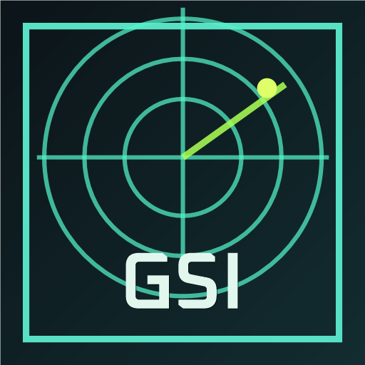
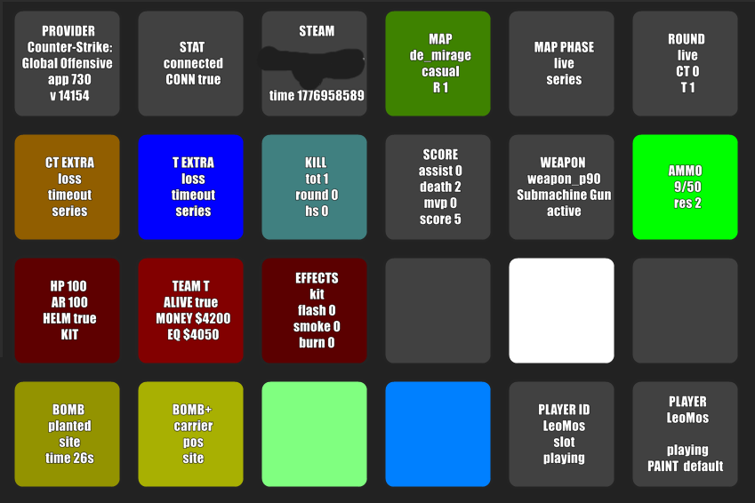

# 🎮 CS2 GSI per Macro Deck



> Stato di gioco live di Counter-Strike 2 sul tuo Macro Deck: HP, soldi, munizioni, stato della bomba, info sul round e altro — come etichette, colori, condizioni e azioni dei pulsanti.
>
> Il plugin riceve i payload GSI di CS2 localmente su `http://127.0.0.1:3333/` e li pubblica come variabili Macro Deck.

**🌐 Leggi in: [English](README.md) · [Italiano](README.it.md)**

---

## ⚡ Guida Rapida

Fai funzionare tutto in circa **5 minuti**. I dettagli sono nelle sezioni qui sotto.

### 1️⃣ Installa il plugin

Copia la cartella del plugin dentro Macro Deck:

```text
%AppData%\Macro Deck\plugins\LeoM.Cs2Gsi
```

La cartella deve contenere almeno questi file:

```text
Cs2MacroDeck.Plugin.dll
Cs2MacroDeck.Plugin.deps.json
ExtensionManifest.json
Plugin.png
ExtensionIcon.png
```

Riavvia Macro Deck.

### 2️⃣ Aggiungi la config GSI di CS2

Crea questo file nella cartella config di CS2:

```text
Counter-Strike Global Offensive\game\csgo\cfg\gamestate_integration_cs2md.cfg
```

Incolla questa config e salva:

```text
"CS2 Macro Deck GSI"
{
    "uri"       "http://127.0.0.1:3333/"
    "timeout"   "5.0"
    "buffer"    "0.1"
    "throttle"  "0.5"
    "heartbeat" "10.0"
    "auth"
    {
        "token" "cs2_macrodeck_secret"
    }
    "output"
    {
        "precision_time"     "3"
        "precision_position" "1"
        "precision_vector"   "3"
    }
    "data"
    {
        "provider"               "1"
        "map"                    "1"
        "map_round_wins"         "1"
        "round"                  "1"
        "player_id"              "1"
        "player_state"           "1"
        "player_weapons"         "1"
        "player_match_stats"     "1"
        "player_position"        "1"
        "bomb"                   "1"
        "phase_countdowns"       "1"
        "allplayers_id"          "1"
        "allplayers_state"       "1"
        "allplayers_match_stats" "1"
        "allplayers_weapons"     "1"
        "allplayers_position"    "1"
        "allgrenades"            "1"
    }
}
```

Riavvia CS2.

### 3️⃣ Verifica che funzioni

Avvia Macro Deck, lancia [Counter-Strike 2 su Steam](https://store.steampowered.com/app/730/CounterStrike_2/) ed entra in una partita live (o in una sessione di allenamento). Poi apri:

```text
http://127.0.0.1:3333/state
```

Dovresti vedere valori come:

```text
HasPayload = true
Provider.AppId = 730
Map.Name = de_mirage / de_inferno / ...
Player.Name = il tuo nome CS2
Player.ActiveWeapon = weapon_...
```

Ancora vuoto? Vedi [Risoluzione dei problemi](#risoluzione-dei-problemi).

### 4️⃣ Usa le variabili

I placeholder di Macro Deck usano trattini bassi al posto dei punti:

```text
Variabile plugin: cs2md.player.hp
Testo pulsante:   {cs2md_player_hp}
```

Esempio di etichetta pulsante:

```text
{cs2md_map_name}
{cs2md_round_phase}
HP {cs2md_player_hp}
{cs2md_weapon_name}
{cs2md_weapon_ammo_clip}/{cs2md_weapon_ammo_clip_max}
```

Fatto! 🎉 Tutto ciò che segue è materiale di riferimento.

---

## Requisiti

- Questo è un plugin per **Macro Deck 2**. Non è un'app standalone.
- Counter-Strike 2 deve essere configurato con un file `gamestate_integration_*.cfg`.
- Il listener è solo locale e si aggancia a `127.0.0.1`.
- Porta predefinita del listener: `3333`.
- Token predefinito: `cs2_macrodeck_secret`.
- Target del manifest dell'estensione: `2.14.1`.
- Testato su Macro Deck `2.15.0-b1`.

Documentazione GSI ufficiale Valve:

https://developer.valvesoftware.com/wiki/Counter-Strike:_Global_Offensive_Game_State_Integration

## Anteprima



## Funzionalità

- Listener GSI locale per CS2.
- Variabili Macro Deck per mappa, round, giocatore, arma, munizioni, soldi, punteggio e stato della bomba.
- Token e porta del listener configurabili.
- Categorie di variabili configurabili.
- Set di variabili predefinito ridotto per il gameplay normale.
- Variabili avanzate opzionali per dati da osservatore/spettatore, tutti i giocatori, granate, JSON grezzo e debug.
- Azioni per aggiornare l'ultimo stato CS2 e resettare il listener locale.
- Endpoint di debug `/state` e `/raw`.

## Installazione

Installa o copia il plugin in:

```text
%AppData%\Macro Deck\plugins\LeoM.Cs2Gsi
```

La cartella del plugin deve contenere almeno:

```text
Cs2MacroDeck.Plugin.dll
Cs2MacroDeck.Plugin.deps.json
ExtensionManifest.json
Plugin.png
ExtensionIcon.png
```

Riavvia Macro Deck dopo l'installazione o la sostituzione dei file del plugin.

## Configurazione di CS2

Crea questo file nella cartella config di CS2:

```text
Counter-Strike Global Offensive\game\csgo\cfg\gamestate_integration_cs2md.cfg
```

Incolla questa config (la stessa della [Guida Rapida](#guida-rapida)):

```text
"CS2 Macro Deck GSI"
{
    "uri"       "http://127.0.0.1:3333/"
    "timeout"   "5.0"
    "buffer"    "0.1"
    "throttle"  "0.5"
    "heartbeat" "10.0"
    "auth"
    {
        "token" "cs2_macrodeck_secret"
    }
    "output"
    {
        "precision_time"     "3"
        "precision_position" "1"
        "precision_vector"   "3"
    }
    "data"
    {
        "provider"               "1"
        "map"                    "1"
        "map_round_wins"         "1"
        "round"                  "1"
        "player_id"              "1"
        "player_state"           "1"
        "player_weapons"         "1"
        "player_match_stats"     "1"
        "player_position"        "1"
        "bomb"                   "1"
        "phase_countdowns"       "1"
        "allplayers_id"          "1"
        "allplayers_state"       "1"
        "allplayers_match_stats" "1"
        "allplayers_weapons"     "1"
        "allplayers_position"    "1"
        "allgrenades"            "1"
    }
}
```

Riavvia CS2 dopo aver aggiunto o modificato la config.

## Configurazione

Apri le impostazioni del plugin in Macro Deck per configurare:

- Token del listener
- Porta del listener
- Categorie di variabili abilitate
- Gruppi di variabili abilitati

La finestra delle impostazioni include anche un pulsante per copiare una config GSI di CS2 usando il token e la porta correnti.

Modificare token o porta del listener riavvia il listener locale dopo il salvataggio delle impostazioni. Se cambi uno di questi valori, aggiorna il file di config di CS2 e riavvia CS2.

## Variabili

I placeholder di Macro Deck usano trattini bassi al posto dei punti.

```text
Variabile plugin: cs2md.player.hp
Testo pulsante:   {cs2md_player_hp}
```

Variabili comuni:

| Variabile | Placeholder | Tipo |
| --- | --- | --- |
| `cs2md.connected` | `{cs2md_connected}` | Bool |
| `cs2md.status` | `{cs2md_status}` | String |
| `cs2md.map.name` | `{cs2md_map_name}` | String |
| `cs2md.map.mode` | `{cs2md_map_mode}` | String |
| `cs2md.map.phase` | `{cs2md_map_phase}` | String |
| `cs2md.map.round` | `{cs2md_map_round}` | Intero |
| `cs2md.round.phase` | `{cs2md_round_phase}` | String |
| `cs2md.round.wins_ct` | `{cs2md_round_wins_ct}` | Intero |
| `cs2md.round.wins_t` | `{cs2md_round_wins_t}` | Intero |
| `cs2md.player.name` | `{cs2md_player_name}` | String |
| `cs2md.player.team` | `{cs2md_player_team}` | String |
| `cs2md.player.hp` | `{cs2md_player_hp}` | Intero |
| `cs2md.player.armor` | `{cs2md_player_armor}` | Intero |
| `cs2md.player.helmet` | `{cs2md_player_helmet}` | Bool |
| `cs2md.player.defusekit` | `{cs2md_player_defusekit}` | Bool |
| `cs2md.player.money` | `{cs2md_player_money}` | Intero |
| `cs2md.player.kills_total` | `{cs2md_player_kills_total}` | Intero |
| `cs2md.player.assists` | `{cs2md_player_assists}` | Intero |
| `cs2md.player.deaths` | `{cs2md_player_deaths}` | Intero |
| `cs2md.player.score` | `{cs2md_player_score}` | Intero |
| `cs2md.weapon.name` | `{cs2md_weapon_name}` | String |
| `cs2md.weapon.type` | `{cs2md_weapon_type}` | String |
| `cs2md.weapon.state` | `{cs2md_weapon_state}` | String |
| `cs2md.weapon.ammo_clip` | `{cs2md_weapon_ammo_clip}` | Intero |
| `cs2md.weapon.ammo_clip_max` | `{cs2md_weapon_ammo_clip_max}` | Intero |
| `cs2md.weapon.ammo_reserve` | `{cs2md_weapon_ammo_reserve}` | Intero |
| `cs2md.bomb.state` | `{cs2md_bomb_state}` | String |
| `cs2md.bomb.timer` | `{cs2md_bomb_timer}` | String |

Esempio di etichetta pulsante:

```text
{cs2md_map_name}
{cs2md_round_phase}
HP {cs2md_player_hp}
{cs2md_weapon_name}
{cs2md_weapon_ammo_clip}/{cs2md_weapon_ammo_clip_max}
```

Le variabili avanzate per tutti i giocatori, granate, vittorie di round per mappa, slot armi del giocatore corrente e JSON grezzo sono disponibili dalle impostazioni del plugin.

Vedi [docs/VARIABLES.it.md](docs/VARIABLES.it.md) per la guida completa alle variabili e altri esempi di pulsanti.

## Valori di Stato

| Valore | Significato |
| --- | --- |
| `starting` | Le variabili sono state inizializzate e il listener sta partendo. |
| `waiting_for_cs2` | Il listener è attivo, ma non è stato ancora ricevuto alcun payload reale da CS2. |
| `connected` | È stato ricevuto un payload reale da CS2 e le variabili sono state aggiornate. |
| `token_invalid` | CS2 ha inviato un payload con un token che non corrisponde a quello del plugin. |
| `port_in_use` | Il plugin non ha potuto agganciarsi alla porta configurata. |
| `listener_offline` | Il plugin sta interrogando `/state`, ma nessun listener è raggiungibile. |
| `restarting` | L'azione di reset sta riavviando il listener. |
| `error` | Si è verificato un errore imprevisto durante la pubblicazione dello stato. |

## Azioni

- `Refresh CS2 state`: legge l'ultima risposta locale `/state` e aggiorna le variabili Macro Deck.
- `Reset CS2 listener`: riavvia il listener locale del plugin e aggiorna `cs2md.status`.

## Debug

Apri questo URL mentre Macro Deck è in esecuzione:

```text
http://127.0.0.1:3333/state
```

Valori attesi dopo che CS2 ha inviato i dati:

```text
HasPayload = true
Provider.AppId = 730
Map.Name = de_mirage / de_inferno / ...
Player.Name = il tuo nome CS2
Player.ActiveWeapon = weapon_...
```

Per ispezionare l'ultimo payload grezzo di CS2:

```text
http://127.0.0.1:3333/raw
```

Righe di log utili:

```text
CS2 Macro Deck plugin enabled.
CS2 GSI server listening on http://127.0.0.1:3333/
```

## Risoluzione dei Problemi

### `/state` è vuoto

- Verifica che CS2 sia stato riavviato dopo aver aggiunto la config GSI.
- Entra in una partita live o in una sessione di allenamento.
- Verifica che il file di config sia nella cartella `cfg` corretta di CS2.
- `cs2md.connected` resta `false` e `cs2md.status` resta `waiting_for_cs2` finché non viene ricevuto un payload GSI reale da CS2.

### Token non corrispondente

- Il token nella config di CS2 deve corrispondere a quello del plugin.
- Token predefinito attuale: `cs2_macrodeck_secret`.
- `cs2md.status` viene impostato su `token_invalid` quando il plugin riceve un payload con il token sbagliato.

### Porta già in uso

- Solo un processo può rimanere in ascolto su `http://127.0.0.1:3333/`.
- Chiudi Macro Deck o qualsiasi listener di debug che usa la stessa porta.
- `cs2md.status` viene impostato su `port_in_use` quando il plugin non può agganciarsi alla porta configurata.

### Alcuni valori sono vuoti

CS2 invia alcuni blocchi GSI solo in determinate modalità o stati della camera.

Di solito disponibili durante il gameplay normale del giocatore:

- `provider`
- `map`
- `round`
- `player_id`
- `player_state`
- `player_weapons`
- `player_match_stats`

Spesso solo da osservatore/spettatore secondo Valve:

- `allplayers_*`
- `allgrenades`
- `bomb.position`
- `bomb.carrier`
- `phase_countdowns`
- `player.position`
- `player.forward`

### Il client del telefono non cambia cartella automaticamente

Nei test locali, i trigger Macro Deck `Variable changed` aggiornavano testo e colori dei pulsanti sul client del telefono, ma `Change folder` attivato dallo stesso evento non cambiava in modo affidabile la pagina del client del telefono.

Preferisci una singola pagina CS2 che cambia etichette, colori e visibilità usando variabili come `cs2md.player.team`.

## Sviluppo

Compila dalla radice del repository:

```powershell
dotnet build Cs2MacroDeck.slnx
```

Il progetto del plugin compila il codice GSI condiviso direttamente in `Cs2MacroDeck.Plugin.dll`, quindi l'output del plugin non richiede `Cs2Gsi.Core.dll`.

Il listener console opzionale può essere avviato con:

```powershell
dotnet run --project Cs2Gsi.Listener\Cs2Gsi.Listener.csproj
```

Chiudi prima Macro Deck, o libera la porta `3333`, prima di eseguire il listener di debug.

## Struttura del Repository

- `Cs2MacroDeck.Plugin`: plugin per Macro Deck.
- `Cs2Gsi.Core`: modelli GSI CS2, parser, valori predefiniti e server HTTP condiviso.
- `Cs2Gsi.Listener`: listener console/debug opzionale per lo sviluppo.

## Privacy

Il plugin ascolta solo su `127.0.0.1` e riceve payload locali di Game State Integration da CS2. Non invia dati CS2 a servizi esterni.

## Licenze di Terze Parti

L'icona usa Oxanium per il lettering `GSI`. Oxanium è rilasciato sotto la SIL Open Font License.

Vedi [THIRD_PARTY_NOTICES.md](THIRD_PARTY_NOTICES.md).

## Licenza

Questo progetto è concesso in licenza MIT. Vedi [LICENSE](LICENSE).
