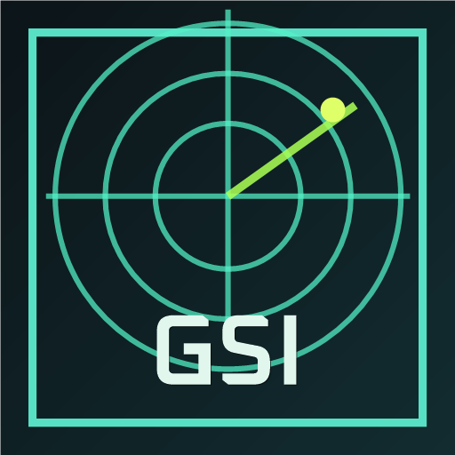

# CS2 GSI for Macro Deck



CS2 GSI for Macro Deck is a Macro Deck 2 plugin for Counter-Strike 2 Game State Integration.

It receives CS2 GSI payloads locally on `http://127.0.0.1:3333/` and publishes the game state as Macro Deck variables that can be used in button labels, colors, conditions, and actions.

## Important

- This is a plugin for Macro Deck 2. It is not a standalone app.
- Counter-Strike 2 must be configured with a `gamestate_integration_*.cfg` file.
- The listener is local only and binds to `127.0.0.1`.
- Default listener port: `3333`.
- Default token: `cs2_macrodeck_secret`.
- Current tested Macro Deck version: `2.15.0-b1`.
- Extension manifest target: `2.15.0`.

Official Valve GSI documentation:

https://developer.valvesoftware.com/wiki/Counter-Strike:_Global_Offensive_Game_State_Integration

## Features

- Local CS2 GSI listener.
- Macro Deck variables for map, round, player, weapon, ammo, money, score, and bomb state.
- Configurable listener token and port.
- Configurable variable categories.
- Default variable set kept small for normal gameplay.
- Optional advanced variables for observer/spectator data, all players, grenades, raw JSON, and debugging.
- Actions to refresh the latest CS2 state and reset the local listener.
- Debug endpoints for `/state` and `/raw`.

## Installation

Install or copy the plugin into:

```text
%AppData%\Macro Deck\plugins\LeoM.Cs2Gsi
```

The plugin folder must contain at least:

```text
Cs2MacroDeck.Plugin.dll
Cs2MacroDeck.Plugin.deps.json
ExtensionManifest.json
Plugin.png
ExtensionIcon.png
```

Restart Macro Deck after installing or replacing the plugin files.

## CS2 Setup

Create this file in the CS2 config folder:

```text
Counter-Strike Global Offensive\game\csgo\cfg\gamestate_integration_cs2md.cfg
```

Paste this config:

```text
"CS2 Macro Deck GSI"
{
    "uri"       "http://127.0.0.1:3333/"
    "timeout"   "5.0"
    "buffer"    "0.1"
    "throttle"  "0.5"
    "heartbeat" "10.0"
    "auth"
    {
        "token" "cs2_macrodeck_secret"
    }
    "output"
    {
        "precision_time"     "3"
        "precision_position" "1"
        "precision_vector"   "3"
    }
    "data"
    {
        "provider"               "1"
        "map"                    "1"
        "map_round_wins"         "1"
        "round"                  "1"
        "player_id"              "1"
        "player_state"           "1"
        "player_weapons"         "1"
        "player_match_stats"     "1"
        "player_position"        "1"
        "bomb"                   "1"
        "phase_countdowns"       "1"
        "allplayers_id"          "1"
        "allplayers_state"       "1"
        "allplayers_match_stats" "1"
        "allplayers_weapons"     "1"
        "allplayers_position"    "1"
        "allgrenades"            "1"
    }
}
```

Restart CS2 after adding or changing the config.

## Configuration

Open the plugin settings in Macro Deck to configure:

- Listener token
- Listener port
- Enabled variable categories
- Enabled variable groups

The settings window also includes a button to copy a CS2 GSI config using the current token and port.

Changing the listener token or port restarts the local listener after saving settings. If you change either value, update the CS2 config file and restart CS2.

## Variables

Macro Deck placeholders use underscores instead of dots.

```text
Plugin variable: cs2md.player.hp
Button text:     {cs2md_player_hp}
```

Common variables:

| Variable | Placeholder | Type |
| --- | --- | --- |
| `cs2md.connected` | `{cs2md_connected}` | Bool |
| `cs2md.status` | `{cs2md_status}` | String |
| `cs2md.map.name` | `{cs2md_map_name}` | String |
| `cs2md.map.mode` | `{cs2md_map_mode}` | String |
| `cs2md.map.phase` | `{cs2md_map_phase}` | String |
| `cs2md.map.round` | `{cs2md_map_round}` | Integer |
| `cs2md.round.phase` | `{cs2md_round_phase}` | String |
| `cs2md.round.wins_ct` | `{cs2md_round_wins_ct}` | Integer |
| `cs2md.round.wins_t` | `{cs2md_round_wins_t}` | Integer |
| `cs2md.player.name` | `{cs2md_player_name}` | String |
| `cs2md.player.team` | `{cs2md_player_team}` | String |
| `cs2md.player.hp` | `{cs2md_player_hp}` | Integer |
| `cs2md.player.armor` | `{cs2md_player_armor}` | Integer |
| `cs2md.player.helmet` | `{cs2md_player_helmet}` | Bool |
| `cs2md.player.defusekit` | `{cs2md_player_defusekit}` | Bool |
| `cs2md.player.money` | `{cs2md_player_money}` | Integer |
| `cs2md.player.kills_total` | `{cs2md_player_kills_total}` | Integer |
| `cs2md.player.assists` | `{cs2md_player_assists}` | Integer |
| `cs2md.player.deaths` | `{cs2md_player_deaths}` | Integer |
| `cs2md.player.score` | `{cs2md_player_score}` | Integer |
| `cs2md.weapon.name` | `{cs2md_weapon_name}` | String |
| `cs2md.weapon.type` | `{cs2md_weapon_type}` | String |
| `cs2md.weapon.state` | `{cs2md_weapon_state}` | String |
| `cs2md.weapon.ammo_clip` | `{cs2md_weapon_ammo_clip}` | Integer |
| `cs2md.weapon.ammo_clip_max` | `{cs2md_weapon_ammo_clip_max}` | Integer |
| `cs2md.weapon.ammo_reserve` | `{cs2md_weapon_ammo_reserve}` | Integer |
| `cs2md.bomb.state` | `{cs2md_bomb_state}` | String |
| `cs2md.bomb.timer` | `{cs2md_bomb_timer}` | String |

Button label example:

```text
{cs2md_map_name}
{cs2md_round_phase}
HP {cs2md_player_hp}
{cs2md_weapon_name}
{cs2md_weapon_ammo_clip}/{cs2md_weapon_ammo_clip_max}
```

Advanced variables for all players, grenades, map round wins, current-player weapon slots, and raw JSON are available from the plugin settings.

## Status Values

| Value | Meaning |
| --- | --- |
| `starting` | Variables were initialized and the listener is starting. |
| `waiting_for_cs2` | The listener is running, but no real CS2 payload has been received yet. |
| `connected` | A real CS2 payload has been received and variables were updated. |
| `token_invalid` | CS2 sent a payload with a token that does not match the plugin token. |
| `port_in_use` | The plugin could not bind to the configured port. |
| `listener_offline` | The plugin is polling `/state`, but no listener is reachable. |
| `restarting` | The reset action is restarting the listener. |
| `error` | An unexpected error occurred while publishing state. |

## Actions

- `Refresh CS2 state`: reads the latest local `/state` response and updates Macro Deck variables.
- `Reset CS2 listener`: restarts the plugin's local listener and updates `cs2md.status`.

## Debugging

Open this URL while Macro Deck is running:

```text
http://127.0.0.1:3333/state
```

Expected values after CS2 sends data:

```text
HasPayload = true
Provider.AppId = 730
Map.Name = de_mirage / de_inferno / ...
Player.Name = your CS2 name
Player.ActiveWeapon = weapon_...
```

To inspect the latest raw CS2 payload:

```text
http://127.0.0.1:3333/raw
```

Useful log lines:

```text
CS2 Macro Deck plugin enabled.
CS2 GSI server listening on http://127.0.0.1:3333/
```

## Troubleshooting

### `/state` is empty

- Confirm CS2 was restarted after adding the GSI config.
- Enter a live match or training session.
- Confirm the config file is in the correct CS2 `cfg` folder.
- `cs2md.connected` remains `false` and `cs2md.status` remains `waiting_for_cs2` until a real CS2 GSI payload is received.

### Token mismatch

- The CS2 config token must match the plugin token.
- Current default token: `cs2_macrodeck_secret`.
- `cs2md.status` is set to `token_invalid` when the plugin receives a payload with the wrong token.

### Port already in use

- Only one process can listen on `http://127.0.0.1:3333/`.
- Close Macro Deck or any debug listener that is using the same port.
- `cs2md.status` is set to `port_in_use` when the plugin cannot bind to the configured port.

### Some values are empty

CS2 only sends some GSI blocks in specific modes or camera states.

Usually available during normal player gameplay:

- `provider`
- `map`
- `round`
- `player_id`
- `player_state`
- `player_weapons`
- `player_match_stats`

Often observer/spectator-only according to Valve:

- `allplayers_*`
- `allgrenades`
- `bomb.position`
- `bomb.carrier`
- `phase_countdowns`
- `player.position`
- `player.forward`

### Phone client does not switch folder automatically

In local testing, Macro Deck `Variable changed` triggers updated button text and colors on the phone client, but `Change folder` triggered by the same event did not reliably switch the phone client page.

Prefer one CS2 page that changes labels, colors, and visibility using variables such as `cs2md.player.team`.

## Development

Build from the repository root:

```powershell
dotnet build Cs2MacroDeck.slnx
```

The plugin project compiles the shared GSI code directly into `Cs2MacroDeck.Plugin.dll`, so the plugin output does not require `Cs2Gsi.Core.dll`.

The optional console listener can be started with:

```powershell
tools\run-listener.cmd
```

Close Macro Deck first, or free port `3333`, before running the debug listener.

## Repository Layout

- `Cs2MacroDeck.Plugin`: Macro Deck plugin.
- `Cs2Gsi.Core`: CS2 GSI models, parser, defaults, and shared HTTP server.
- `Cs2Gsi.Listener`: optional console/debug listener for development.
- `tools`: helper launch files for the debug listener.

## Privacy

The plugin listens only on `127.0.0.1` and receives local CS2 Game State Integration payloads. It does not send CS2 data to an external service.

## Third Party Licenses

The icon uses Oxanium for the `GSI` lettering. Oxanium is released under the SIL Open Font License.

See [THIRD_PARTY_NOTICES.md](THIRD_PARTY_NOTICES.md).

## License

This project is licensed under the MIT License. See [LICENSE](LICENSE).
